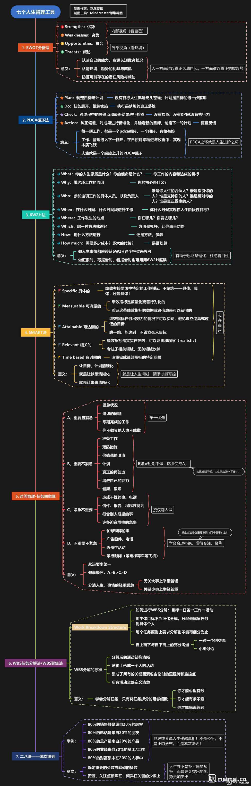

# 2020-信息安全部


## 目录

* [部门介绍](#部门介绍)
* [技能分支](#技能分支)

  * 安全攻防
  * 安全开发
  * 逆向工程
* [职业体系](#职业体系)

  * 工程
    * 安全服务工程师
    * 渗透测试工程师
    * 技术支持工程师
    * ...
  * 研发
    * 安全研究员
    * 安全开发工程师
    * ...
  * 市场
* [学习方法](#学习方法)

部门介绍
------

```
信息安全部研究范围较广，以网络安全技能导向为主，主要涉及网络安全与软件开发两个分支。
赛事：CTF夺旗赛及网络安全安全比赛。
```

技能分支
------
```
无法给出完整知识点，自行搜索，学无止境。
```
##### 基础
- linux基础 
- 网络基础
- 数据库基础
- 代码基础
```
linux系统操作、结构；
osi七层模型、tcp/udp等协议基础；
数据库操作、数据库类型；
php、html、css、js；
了解基础即可，后续再根据需求选择性的进行深入研究。
```
##### Web安全
- 信息收集
	- Web信息
	- 服务器信息
	- 域名信息
	- 其他信息
- Web漏洞
	- sql注入
	- 文件包含
	- 文件上传
	- 文件操作
		- 文件下载
		- 文件删除
		- 文件读取
	- 反序列化
		- php反序列化
		- java反序列化
	- 跨站脚本攻击
		- xss
		- xssi
	- 逻辑漏洞
		- 密码找回
		- 水平/垂直越权
		- 支付
		- 接口
		- 未授权访问
		- 验证码
	- rce
		- 代码执行
			- php
			- java
		- 命令执行
			- windows
			- linux
		- csrf、ssrf、crlf
		- xxe
		- ssti
- javaweb
	- json web token
- 服务组件攻击
	- redis
	- apache
	- nginx
	- tomcat
	- iis
	- jboos
- 代码审计(有/无框架cms)
- waf绕过
- ctf
- 漏洞发现
	- 系统漏洞发现
	- Web漏洞发现
- 漏洞利用
	- 远程、本地
- SRC

##### 红蓝对抗
- ATT&CK

##### 安全开发
- 红队工具开发
- Shellcode免杀
- 蓝队工具开发
- od、xdbg插件开发
- 破解补丁开发
- 语言调试器开发
- 图形化msf
##### 逆向工程
- 基础
	- C/C++
	- pe结构
	- 汇编语言
	- 数据结构
- Windows
	- win编程
	- SDK
	- MFC/QT
	- 网络编程
	- com组件
	- win内核机制
	- 驱动
	- 进程注入
- 二进制漏洞
	- 栈溢出
	- 内存破坏
	- 内核级
	- RPC
	- 堆溢出
	- 双重释放
	- 整数溢出
	- 访问越界
	- 释放引用
	- 类型混淆
	- 格式化字符串
	- DEP绕过
	- shellcode
	- ...
- 破解
	- 调试
	- 特征码
	- 脱壳
	- 算法
	- 常见问题处理
	- 逆VM
	- 反调试/防破解
	- dll劫持
	- com劫持
	- 补丁
##### 安全运维
- linux运维
- 应急响应
- win运维
- 域
- 溯源
##### 其他
- 社会工程学
	- OSINT
- 暴力破解
- 
职业体系
------
```
仅供参考，来源于招聘网站，需根据企业实际要求决定。
```
|               网站               |
| :------------------------------: |
|[拉勾网](https://www.lagou.com/) |
|[BOSS直聘](https://www.zhipin.com/)|
|...|
|各个安全论坛与各个安全企业官网招聘栏目|

##### 工程
  - 安全服务工程师
1．等保测评的项目实施及管理包括等保测评的物理安全测评、主机安全测评、数据安全测评、应用安全测评、安全管理的测评；
2．系统渗透测试、安全加固、安全整改、漏洞扫描的实施配合；
3．测评报告及风险评估报告的编写；
4．为客户提供信息安全咨询服务，如信息安全解决方案、信息安全知识的培训等；
5．配合其它安全服务项目的实施或技术支持工作；
  - 渗透测试工程师
1．根据项目需要，实施对授权的主机、网络和Web的渗透测试；
2．提供网络安全攻防技术培训演练及应急响应工作。
3．对互联网领域的重大安全事件进行跟踪、分析；
4．对安全领域的新技术、新方法进行研究。
  - 技术服务工程师
负责公司安全、虚拟化、云计算产品线在客户端的交付工作。结合客户需求及IT现状，验证解决方案的可行性，对项目交付的问题和风险进行决策和管控，为客户提供解决方案和技术服务。
  - 安全研究员
1．对授权的目标进行渗透测试，并编写相应的渗透测试报告；
2．对黑客攻击事件进行应急处置与追踪溯源；
3．WEB安全研究，独立漏洞挖掘；
4．最新安全漏洞跟踪与分析。
  - ...自行搜索...
```
根据能力的深浅，负责的业务不同，不同岗位的职能都会有重复的地方。但总的来说红蓝对抗>渗透测试>Web安全。
```
##### 研发
  - 安全开发工程师
１．研究安全攻防技术、新型安全防护算法的前沿发展趋势
２．网络行为分析算法及模型研究
３．研究机器学习、AI技术在安全防护中的应用
４．负责公司安全检测与防护类产品（威胁情报、态势感知）研发
  - ...自行搜索...
##### 市场
  - ...自行搜索...

学习方法
------

|               途径               |
| :------------------------------: |
|**github**|
|百度、Google搜索 |
|论坛搜索、微信搜索(公众号文章)、知识星球|
|bilibili、yutube|
|书籍|
|请教他人(提问的艺术)|
|...|
##### 其他
各种安全相关思维导图整理收集：https://github.com/phith0n/Mind-Map

CTF学习平台：https://ctf.bugku.com/  ...

收集大量 CTF 题目和 wp 的项目：https://github.com/Imtinmin/CTF_Challenge
```
善用搜索引擎
```
